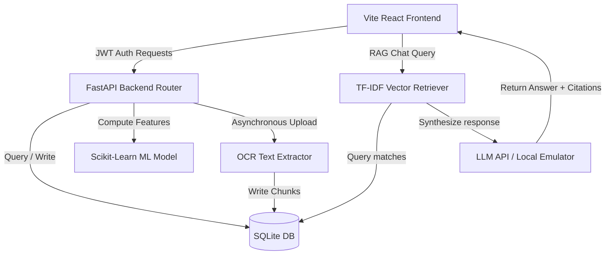

# ProjectPulse AI — MoSPI Integrated Project-Monitoring Platform (Civiclens)

ProjectPulse AI (Civiclens) is a full-stack, production-ready project monitoring and intelligence platform built for the **Smart India Hackathon 2026** (Problem Statement: **SIH26103**, Category: **Smart Automation**). Designed for the **Ministry of Statistics and Programme Implementation (MoSPI)**, the application monitors central sector project timelines, detects financial/physical progress anomalies, predicts project delay risks using Machine Learning, and indexes uploaded project documents using OCR and LLM/RAG (Retrieval-Augmented Generation) document search.

The UI/UX replicates the clean, professional, light-themed serif design language of the official Government of India **MPLADS Portal** (navy blue primary branding, gold highlights, card statistics with colored background badges).

---

## 🏛️ Core Features

*   **Secure Authentication & RBAC**: Real JWT session authentication with Role-Based Access Control enforcing boundaries for `SUPER_ADMIN`, `ADMIN` (Department Officer), `PROJECT_MANAGER`, and `VIEWER` roles.
*   **Geospatial India Map**: An interactive SVG map of India showing project distributions, ongoing/delayed metrics, and budget utilization rates with click-to-filter state drilling.
*   **AI Delay Prediction**: A Scikit-Learn Random Forest Classifier and Regressor trained on synthetic project features (physical progress, elapsed time ratio, budget utilization, overdue milestones) predicting delay probabilities and expected overrun days.
*   **Automated Anomaly Engine**: Automatic real-time warning generator flagging progress-budget disparities (e.g. 82% spent but 43% physical progress) and overdue milestones.
*   **OCR Document Scanner**: Text extraction from project PDFs and tender attachments (utilizing digital text parsing with pdfplumber and scanned fallbacks).
*   **AI Document RAG Chat**: Retrieve context chunks from uploaded documents and query them with page citations (runs online using Gemini/OpenAI API or 100% offline using a local keyword-search emulator).
*   **AI Report Generator**: Live Markdown report compiler for Project Status, Delay Assessments, and Risk Mitigations.
*   **Audit Trail Logs**: Cryptographic-like admin logs tracking login histories, updates, uploads, and AI queries.

---

## 🛠️ Technology Stack

| Layer | Technology |
| :--- | :--- |
| **Frontend** | React, TypeScript, Vite, Tailwind CSS, Lucide icons, Recharts |
| **Backend** | Python, FastAPI, SQLAlchemy, Pydantic, Uvicorn |
| **Database** | SQLite (with WAL mode enabled for high concurrency) |
| **AI/ML Model** | Scikit-Learn (Random Forest Classifier & Regressor), Pandas, NumPy, Joblib |
| **OCR & RAG** | pdfplumber, TF-IDF Cosine Similarity Vectorization, Gemini / OpenAI direct API |

---

## 🔑 Test Credentials

The database is seeded automatically on backend startup with 3 authorized default accounts (all sharing development password `password123`):

*   **Super Admin**: `admin@example.com` (Full access: manage users, create projects, view audits)
*   **Project Manager**: `manager@example.com` (Manage department projects, update milestones, upload files)
*   **Decision Maker (Viewer)**: `viewer@example.com` (Read-only maps, analytics, ask AI queries)

---

## ⚙️ Environment Setup

1. Clone or navigate to the project directory:
   ```bash
   cd "C:\sayali ai apps\newsih"
   ```
2. Copy the `.env.example` file to `.env`:
   ```bash
   copy .env.example .env
   ```
3. *(Optional)* Add your Gemini or OpenAI API keys inside `.env` to enable online cloud-based LLM outputs:
   ```env
   GEMINI_API_KEY=your_gemini_api_key_here
   OPENAI_API_KEY=your_openai_api_key_here
   ```
   *If left empty, the platform automatically triggers the built-in RAG Emulator, which simulates LLM answers by indexing context chunks (perfect for offline demos).*

---

## 🚀 Running the Platform

### 1. Launch the Backend API
1. Navigate to the backend directory:
   ```bash
   cd backend
   ```
2. Activate the Python virtual environment:
   ```bash
   ..\venv\Scripts\activate
   ```
3. Run the FastAPI development server:
   ```bash
   uvicorn app.main:app --reload --host 127.0.0.1 --port 8000
   ```
   *FastAPI documentation will be available at: http://127.0.0.1:8000/docs*
   *The database `projectpulse.db` is initialized and seeded with 30 projects automatically on first run.*

### 2. Launch the Frontend UI
1. Open a new terminal session and navigate to the frontend directory:
   ```bash
   cd frontend
   ```
2. Start the Vite React development server:
   ```bash
   npm run dev
   ```
3. Open http://localhost:5173 inside your browser.

---

## 📈 System Architecture & Data Flow



---
*Developed under MoSPI integration guidelines for Smart India Hackathon 2026.*
